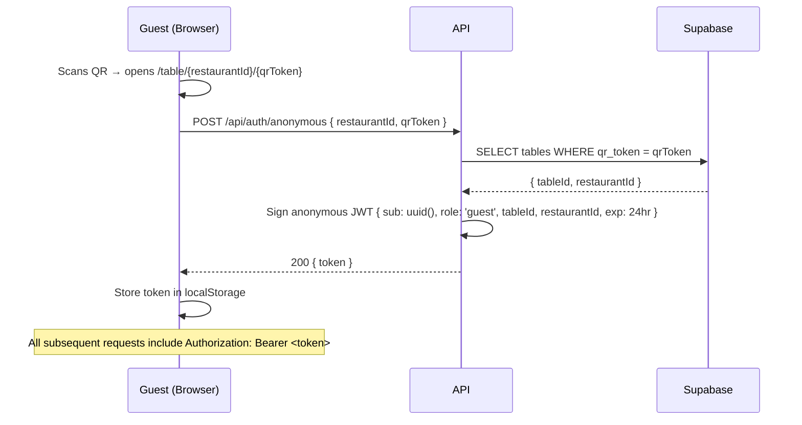
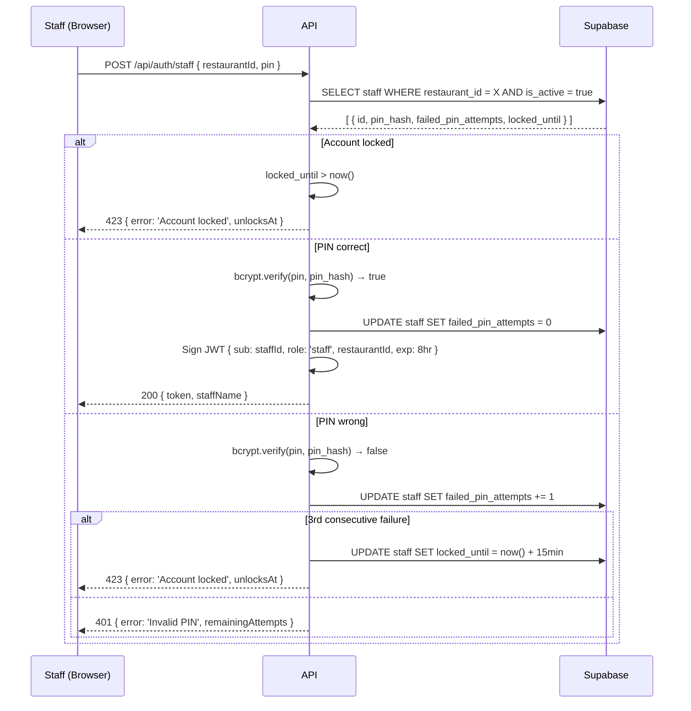
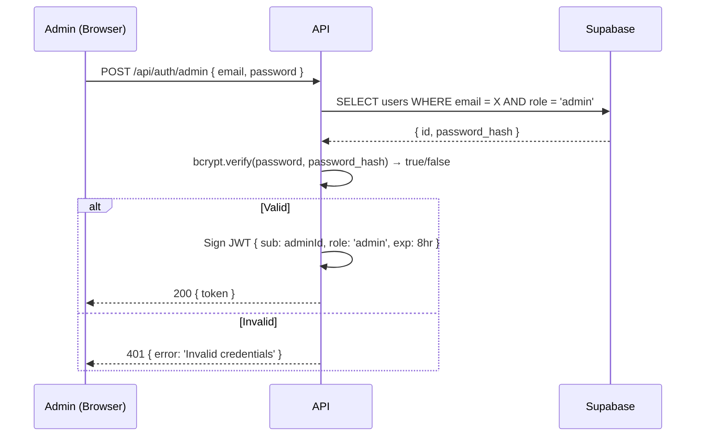

# Architecture: Authentication Flow

**Type:** Sequence Diagrams · **Scope:** All four authentication paths

---

## 1. Path Overview

| Actor | Method | Token |
|-------|--------|-------|
| Guest | Anonymous — no credentials | JWT (anonymous, 24 hr) |
| Staff | 4-digit PIN → bcrypt verify | JWT (8 hr) |
| Owner | Google OAuth 2.0 (OIDC) | JWT (session-based) |
| Admin | Seeded email + password | JWT (8 hr) |

---

## 2. Guest Anonymous Auth



---

## 3. Staff PIN Auth



---

## 4. Owner Google OAuth

```mermaid
sequenceDiagram
  participant O as Owner (Browser)
  participant API as API
  participant G as Google OAuth 2.0
  participant DB as Supabase GoTrue

  O->>API: GET /api/auth/owner/google/login
  API-->>O: 302 → Google consent screen URL
  O->>G: User grants permission
  G->>API: GET /api/auth/owner/google/callback?code=...
  API->>G: POST token exchange (code → id_token + access_token)
  G-->>API: { id_token: { email, sub, name } }
  API->>DB: UPSERT users WHERE email = X
  DB-->>API: { userId, restaurantId? }
  alt No restaurant yet
    API-->>O: 200 { token, onboardingRequired: true }
  else Existing owner
    API->>API: Sign JWT { sub: userId, role: 'owner', restaurantId, exp: session }
    API-->>O: 200 { token, restaurantId }
  end
  O->>O: Store token; redirect to /owner/dashboard
```

---

## 5. Admin Auth



---

## 6. JWT Authorization Summary

All protected API endpoints examine the JWT `role` claim:

| Role claim | Accessible paths |
|------------|-----------------|
| `guest` | `GET /api/menus/*`, `POST /api/orders`, `GET /api/orders/{id}` |
| `staff` | All guest paths + `PATCH /api/orders/{id}/status`, `GET /api/tables` |
| `owner` | All staff paths + `/api/restaurants/{id}/*`, `/api/print/*` |
| `admin` | `/api/admin/*` only |

Staff and owner claims also include `restaurantId`; all data queries are scoped to that restaurant.
