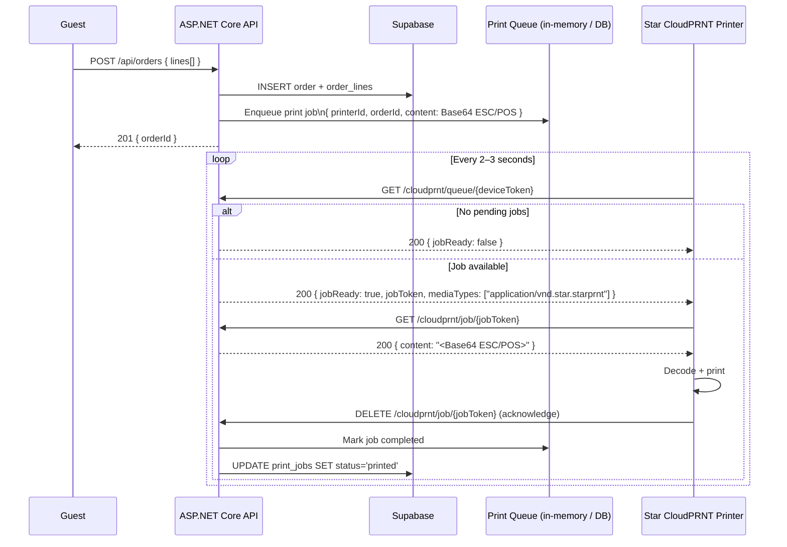
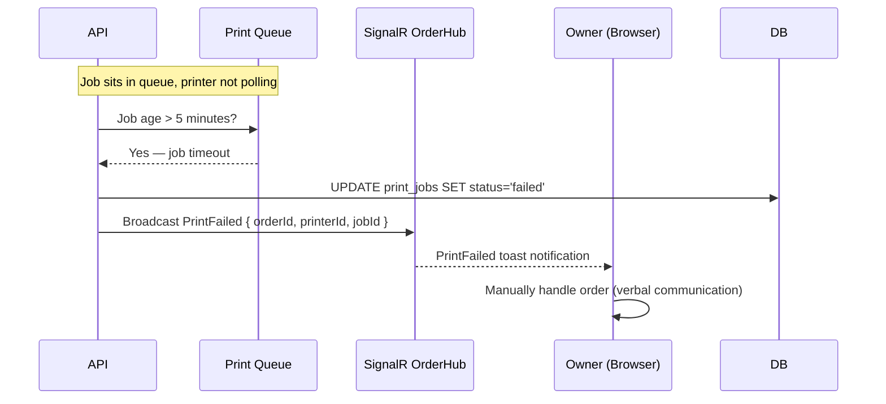

# Architecture: CloudPRNT Flow

**Type:** Sequence Diagram · **Scope:** Star CloudPRNT polling protocol

---

## 1. Protocol Overview

CloudPRNT is a **server-pull** protocol — the printer periodically polls the server for pending jobs, rather than the server pushing to the printer. This means the printer can be behind NAT with no inbound port exposure.

```
Printer polls every 2–3 seconds
Server queues jobs on order creation
Printer acknowledges after printing
```

---

## 2. Happy Path Sequence



---

## 3. Printer Offline / Timeout Path



---

## 4. Print Job Content Format

Jobs are encoded as Base64 ESC/POS commands:

```
┌──────────────────────────────┐
│     ORDER #42  Bàn 5         │ ← Header
│     2024-01-15  19:42        │
├──────────────────────────────┤
│  1x Pho Bo Special    £12.50 │ ← Line items
│     + Extra noodles   £ 1.00 │ ← Modifiers
│  2x Spring Rolls      £ 8.00 │
│     No peanuts               │ ← Special instructions
├──────────────────────────────┤
│  TOTAL                £21.50 │ ← Total
└──────────────────────────────┘
```

ESC/POS encoding handled server-side before enqueuing. Printer receives final bytes only.

---

## 5. Device Token Security

- Each printer has a unique `device_token` (UUID) generated on registration
- Token is used as the URL path segment for CloudPRNT polling: `/cloudprnt/queue/{deviceToken}`
- Token is masked in the UI (first 6 chars + `…`) — shown in full only at registration time
- Token regeneration: `POST /api/printers/{id}/regenerate-token`; old token immediately invalid, outstanding jobs are re-queued under new token

---

## 6. Printer Status Detection

| Last Seen | Status | UI Color |
|-----------|--------|----------|
| < 60 seconds ago | Online | Green |
| 1 – 5 minutes ago | Idle | Grey |
| > 5 minutes ago | Offline | Red |

Status is derived from `last_seen_at` updated on every POLL request (even when no job is available).

---

## 7. Multiple Printers

A restaurant may have multiple printers (e.g., kitchen + bar):

- Order lines can be routed to specific printers based on item category
- Future item: `items.printer_id FK` routing field (not in v1)
- In v1: all printers in a restaurant receive a copy of every order
