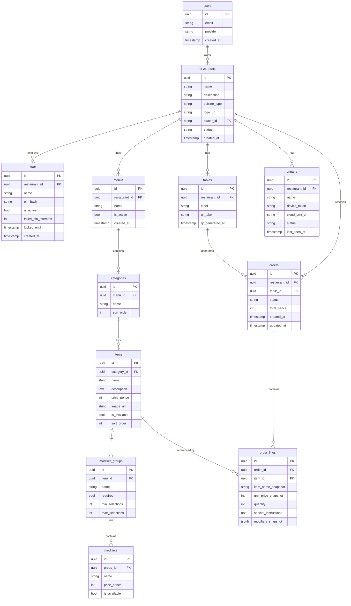

# Architecture: Data Model

**Type:** ER Diagram · **Scope:** Supabase PostgreSQL schema

---

## 1. Entity Relationship Diagram

---

## 2. Key Design Decisions

### 2.1 Snapshot fields on `order_lines`
`item_name_snapshot`, `unit_price_snapshot`, and `modifiers_snapshot` capture the item state at order time. Menu edits after order placement do not retroactively change order records.

### 2.2 Restaurant `status` column
- `pending_approval` — newly registered, not yet approved by admin
- `active` — fully operational
- `suspended` — admin-disabled; all logins blocked
- `rejected` — registration rejected by admin

### 2.3 Staff PIN security
- `pin_hash` — bcrypt hash, never stored in plain text
- `failed_pin_attempts` — counter incremented on each failure
- `locked_until` — 15-minute lockout after 3 consecutive failures

### 2.4 Table QR tokens
- `qr_token` — UUID, changes when "Regenerate QR" is triggered
- Old tokens immediately invalid; outstanding guest sessions are treated as expired

### 2.5 Price storage
All prices stored as integer pence (or whole currency units in VND context). No floating-point arithmetic in the database or API.

---

## 3. Table Summary

| Table | Row estimate | Notes |
|-------|-------------|-------|
| `restaurants` | 1 per tenant | Core tenant entity |
| `users` | 1 per owner | Managed by Supabase GoTrue |
| `staff` | ~5–30 per restaurant | PIN-auth, not in GoTrue |
| `tables` | ~5–50 per restaurant | QR-linked |
| `menus` | 1–3 per restaurant | Typically 1 active |
| `categories` | ~3–15 per menu | |
| `items` | ~10–100 per category | Image in cloud storage |
| `modifier_groups` | 0–10 per item | |
| `modifiers` | 2–10 per group | |
| `orders` | High volume | Partitioned by date recommended |
| `order_lines` | ~3–10 per order | Append-only |
| `printers` | 1–5 per restaurant | CloudPRNT devices |
