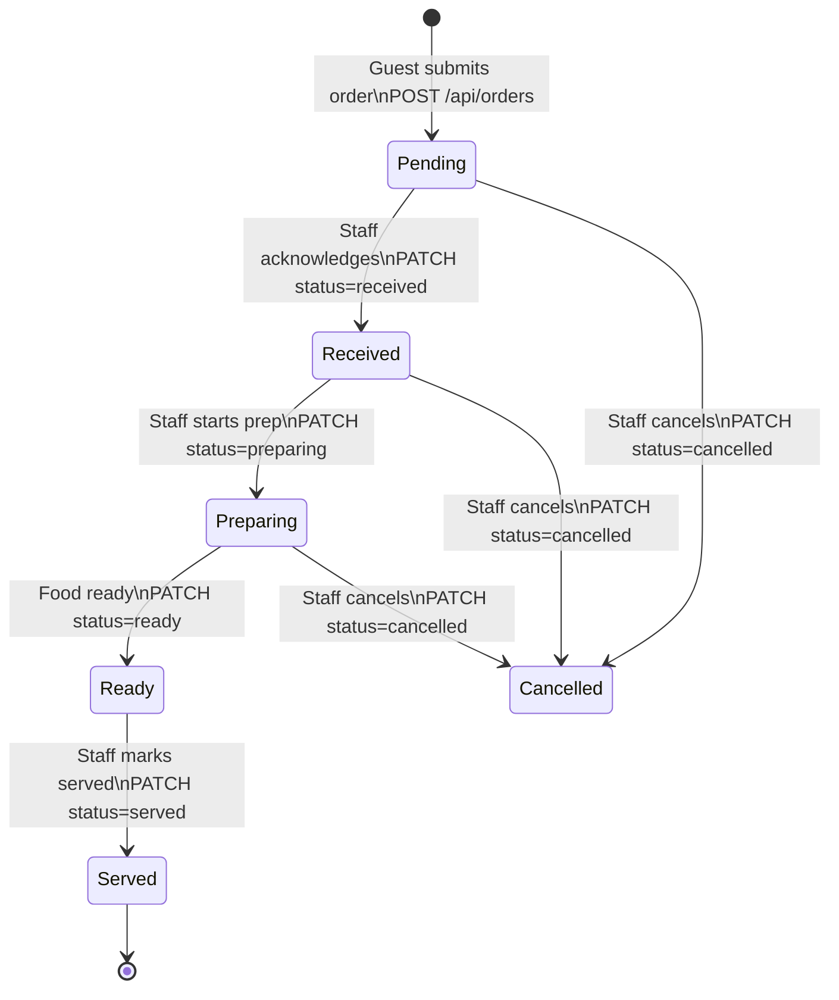
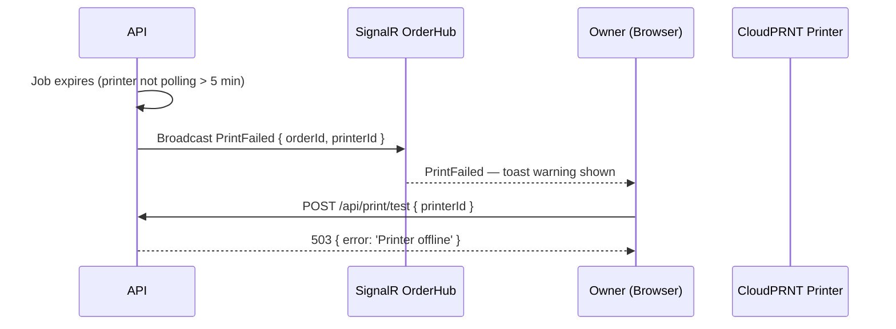

# Architecture: Order Flow

**Type:** State Machine + Sequence Diagram · **Scope:** Full order lifecycle

---

## 1. Order Status State Machine



---

## 2. Full Order Sequence

```mermaid
sequenceDiagram
  participant G as Guest (Browser)
  participant API as ASP.NET Core API
  participant DB as Supabase PostgreSQL
  participant HUB as SignalR OrderHub
  participant S as Staff (Browser)
  participant P as CloudPRNT Printer

  G->>API: POST /api/orders { orderType, tableId?, restaurantId, lines[] }
  API->>API: Validate: orderType=table requires tableId; orderType=take_away forbids tableId (422 on mismatch)
  API->>DB: INSERT orders + order_lines (status=pending)
  API->>HUB: Broadcast OrderReceived { orderId, orderType, tableId, lines[] }
  HUB-->>S: OrderReceived event
  HUB-->>G: OrderReceived (confirmation)
  API->>API: Queue print job (ESC/POS Base64)
  API-->>G: 201 { orderId, status: 'pending' }

  P->>API: GET /api/print/jobs (poll every 2–3s)
  API-->>P: { jobId, content: "<Base64 ESC/POS>" }
  P->>P: Print receipt
  P->>API: POST /api/print/jobs/{jobId}/ack

  S->>API: PATCH /api/orders/{id}/status { status: 'received' }
  API->>DB: UPDATE orders SET status='received'
  API->>HUB: Broadcast OrderStatusChanged { orderId, status }
  HUB-->>G: OrderStatusChanged — guest tracker updates
  HUB-->>S: OrderStatusChanged — staff floor view updates

  Note over S,API: Repeat for preparing → ready

  S->>API: PATCH /api/orders/{id}/status { status: 'ready' }
  API->>DB: UPDATE orders SET status='ready'
  API->>HUB: Broadcast OrderStatusChanged { orderId, status: 'ready' }
  HUB-->>G: OrderStatusChanged — "Your order is ready!"

  S->>API: PATCH /api/orders/{id}/status { status: 'served' }
  API->>DB: UPDATE orders SET status='served'
```

---

## 3. Print Failure Path



---

## 4. Status Definitions

| Status | Actor | Meaning |
|--------|-------|---------|
| `pending` | System | Order submitted, waiting for staff acknowledgement |
| `received` | Staff | Staff has seen and acknowledged the order |
| `preparing` | Staff | Kitchen is actively preparing |
| `ready` | Staff | Food is plated and ready for service |
| `served` | Staff | Delivered to table (dine-in) / collected at counter (take-away) |
| `cancelled` | Staff | Voided before completion |

---

## 5. Real-time Delivery Guarantees

- **SignalR with group fanout** — all group members receive the event
- **Reconnect resilience** — clients re-subscribe to groups on reconnect; Vue composable handles exponential backoff (1 s → 2 s → 4 s … max 30 s)
- **Missed events** — on reconnect, clients call `GET /api/orders/{orderId}` (guest) or `GET /api/orders?restaurantId=X&status=active` (staff) to reconcile state
