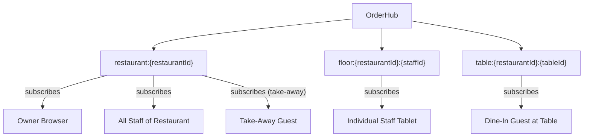
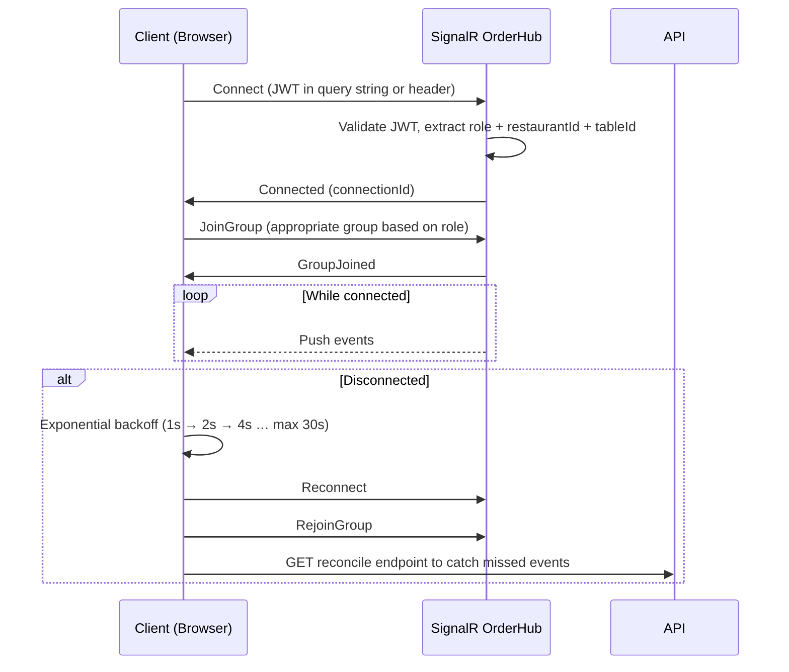

# Architecture: SignalR Events

**Type:** Graph + Reference Table · **Scope:** SignalR OrderHub event model

---

## 1. Hub Group Structure



---

## 2. Events Reference

### 2.1 `OrderReceived`

**Direction:** Server → Client  
**Groups:** `restaurant:{restaurantId}`  
**Triggered by:** `POST /api/orders` (new order created)

```typescript
{
  event: 'OrderReceived',
  payload: {
    orderId: string,
    orderType: 'table' | 'take_away',
    tableId: string | null,
    tableLabel: string | null,
    items: [{ name, quantity, modifiers, specialInstructions }],
    total: number,
    createdAt: string
  }
}
```

**Receivers:** Owner, all Staff of the restaurant  
**Effect:** Staff floor view shows new order badge; owner dashboard increments today's order count

---

### 2.2 `OrderStatusChanged`

**Direction:** Server → Client  
**Groups:** `restaurant:{restaurantId}` + `table:{restaurantId}:{tableId}` (dine-in) / `restaurant:{restaurantId}` only (take-away)  
**Triggered by:** `PATCH /api/orders/{id}/status`

```typescript
{
  event: 'OrderStatusChanged',
  payload: {
    orderId: string,
    orderType: 'table' | 'take_away',
    tableId: string | null,
    status: 'received' | 'preparing' | 'ready' | 'served' | 'cancelled',
    updatedAt: string
  }
}
```

**Receivers:** Staff (restaurant group) + Guest (table group)  
**Effect:**
- Guest tracker updates progress bar
- Staff floor card updates status chip and sort order
- `ready` status triggers guest push notification (if PWA permission granted)

---

### 2.3 `PrintFailed`

**Direction:** Server → Client  
**Groups:** `restaurant:{restaurantId}`  
**Triggered by:** Print job timeout (> 5 minutes without printer acknowledgement)

```typescript
{
  event: 'PrintFailed',
  payload: {
    orderId: string,
    printerId: string,
    printerName: string,
    jobId: string,
    failedAt: string
  }
}
```

**Receivers:** Owner, all Staff  
**Effect:** Toast warning in owner dashboard and staff floor view

---

### 2.4 `MenuItemAvailabilityChanged`

**Direction:** Server → Client  
**Groups:** `restaurant:{restaurantId}`  
**Triggered by:** `PATCH /api/items/{id} { isAvailable: false }` (owner toggles availability)

```typescript
{
  event: 'MenuItemAvailabilityChanged',
  payload: {
    itemId: string,
    restaurantId: string,
    isAvailable: boolean,
    updatedAt: string
  }
}
```

**Receivers:** Owner, all Staff, all Guests currently browsing the menu  
**Effect:**
- Menu page greys out the item and shows "Unavailable" chip
- Items already in guest cart show a warning: "Item no longer available — please remove before placing order"

---

## 3. Client Subscription Lifecycle



---

## 4. Connection Transport Priority

SignalR negotiates the best available transport:

1. **WebSocket** — preferred; lowest latency
2. **Server-Sent Events** — fallback for proxies that block WS upgrades
3. **Long Polling** — last resort; works everywhere

All three share the same event model and group membership semantics.

---

## 5. Authorization Rules

| JWT Role | Can join group | Can receive events |
|----------|---------------|-------------------|
| `guest` (dine-in) | `table:{restaurant}:{table}` only | `OrderStatusChanged` |
| `guest` (take-away) | `restaurant:{restaurant}` only | `OrderStatusChanged` |
| `staff` | `restaurant:{restaurant}` + `floor:{restaurant}:{staff}` | `OrderReceived`, `OrderStatusChanged`, `PrintFailed`, `MenuItemAvailabilityChanged` |
| `owner` | `restaurant:{restaurant}` | All events |
| `admin` | None (admin has no real-time UI) | — |

The Hub enforces these rules on `JoinGroup` calls; unauthorized join attempts are rejected with HTTP 403.
