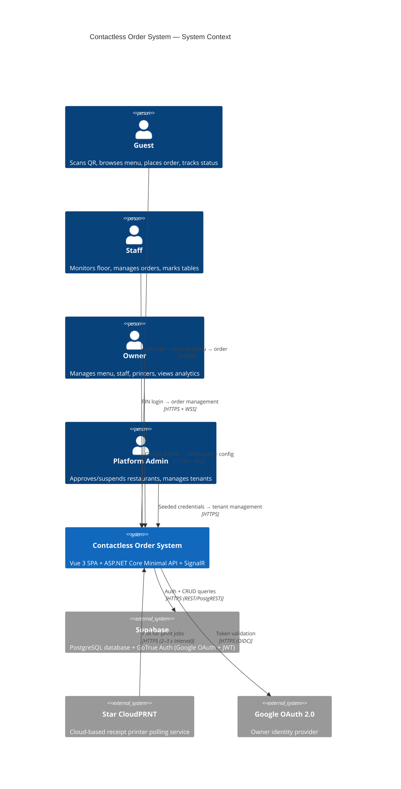

# Architecture: System Overview

**Type:** C4 Context Diagram · **Scope:** Full platform

---

## 1. Runtime Context



---

## 2. Deployment Topology

```
┌──────────────────────────────────────────────────────────────────┐
│                        GitHub Pages (CDN)                        │
│         Vue 3 SPA + Vuetify 3 + Pinia + Vue Router 4            │
│               (Static files — Vite production build)            │
└────────────────────────────────┬─────────────────────────────────┘
                                 │ HTTPS
                                 ▼
┌──────────────────────────────────────────────────────────────────┐
│                    Render / Railway (or similar)                 │
│          ASP.NET Core 10 Minimal API  +  SignalR OrderHub        │
│                     .NET 10 / C# 14                              │
└────────────┬───────────────────┬──────────────────────┬──────────┘
             │                   │                      │
             ▼ PostgREST         ▼ GoTrue Auth          ▼ WSS/HTTPS
┌────────────┴──────┐  ┌─────────┴──────────┐  ┌───────┴──────────┐
│  Supabase         │  │  Google OAuth 2.0  │  │  Star CloudPRNT  │
│  PostgreSQL       │  │                    │  │  Receipt Printer │
└───────────────────┘  └────────────────────┘  └──────────────────┘
```

---

## 3. Key Communication Paths

| Path | Protocol | Notes |
|------|----------|-------|
| Guest → API | HTTPS REST | Anonymous JWT issued on first visit |
| Staff → API | HTTPS REST | bcrypt PIN → JWT (8 hr) |
| Owner → API | HTTPS REST | Google OIDC → JWT |
| Admin → API | HTTPS REST | Seeded email/password → JWT |
| All clients → SignalR | WSS (WebSocket) | Fallback: Server-Sent Events, Long Polling |
| CloudPRNT → API | HTTPS REST | Printer polls every 2–3 s for queued jobs |
| API → Supabase | HTTPS REST | Service role key (server-side only) |

---

## 4. SignalR Hub Groups

```
OrderHub
  ├── restaurant:{restaurantId}        — owner, all staff of restaurant
  ├── floor:{restaurantId}:{staffId}   — individual staff tablet
  └── table:{restaurantId}:{tableId}  — guest at specific table
```

Events pushed over SignalR:

| Event | Direction | Subscribers |
|-------|-----------|-------------|
| `OrderReceived` | Server → Client | Owner, Staff |
| `OrderStatusChanged` | Server → Client | Guest, Staff |
| `PrintFailed` | Server → Client | Owner |
| `MenuItemAvailabilityChanged` | Server → Client | All guests at restaurant |

---

## 5. Security Boundary

- **API** is the only system that holds Supabase service role key
- **Clients** never connect directly to Supabase
- **Admin** is seeded — no self-registration path
- **Staff** PINs are one-way bcrypt; never transmitted after creation
