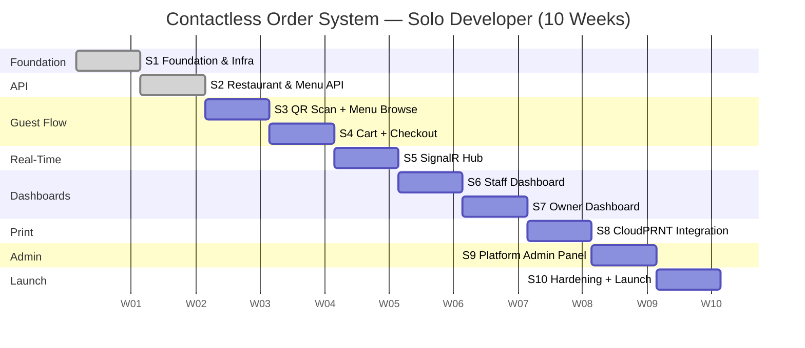

# Project Timeline & Workload Estimate

**Contactless Order System** · Sprint Plan · v1.0

---

## Summary

| Scenario | Duration | Notes |
|----------|----------|-------|
| **Solo developer** | ~10 weeks | One full-stack dev, 5–6 productive hours/day |
| **2-person team** | ~6 weeks | Backend + frontend split; some sprints run in parallel |
| **Risk buffer (+20%)** | +2 weeks | Unknown integrations, stakeholder feedback cycles |

> **Assumptions:** All sprints are 1 calendar week. Developer is familiar with .NET, Vue 3, and Supabase but has not built CloudPRNT or blue-green Docker deployments before.

---

## Sprint Breakdown

### Sprint 1 — Foundation & Infrastructure
**Duration:** 1 week · **Effort:** ~21 story points

| Task | Notes |
|------|-------|
| Monorepo setup (`src/Api/`, `src/Frontend/`) | GitHub Actions scaffolded |
| Database schema + Supabase RLS policies | All tables, constraints, row-level security |
| Auth middleware skeleton (JWT validation, tenant scoping) | Middleware validates Supabase JWTs |
| CI/CD pipeline | GitHub Actions → SSH deploy to Civo VM |
| Blue-green Docker Compose setup | `docker-compose.blue.yml`, `docker-compose.green.yml`, `switch-stack.sh` |
| VitePress documentation baseline | Covers architecture, PRD, project context |

**Deliverable:** Deployable skeleton with CI/CD. `GET /health` returns 200 in production.

---

### Sprint 2 — Restaurant & Menu API
**Duration:** 1 week · **Effort:** ~18 story points

| Task | Notes |
|------|-------|
| Restaurant CRUD endpoints | Owner-scoped; Supabase RLS enforced |
| Menu categories + items CRUD | With availability toggle and soft-delete (archive) |
| Modifier groups + modifiers CRUD | Required/optional groups, price delta, min/max selections |
| Supabase Storage integration | Menu item photos via S3-compatible bucket |
| Table management + QR token generation | HMAC-signed restaurant token; PNG/PDF download |

**Deliverable:** Owner can configure a complete restaurant (menu, tables, QR) via API.

---

### Sprint 3 — Guest Flow: QR Scan → Menu Browse
**Duration:** 1 week · **Effort:** ~16 story points

| Task | Notes |
|------|-------|
| QR code scan → validate token → open guest session | No login, no app install |
| Vue 3 + Vuetify guest frontend scaffolding | Role-based routing; Pinia state |
| Menu browse page (categories + items) | Unavailable items visually disabled |
| Item detail page with modifiers | Required modifier validation before add-to-cart |
| Item photos display | Lazy-loaded from Supabase Storage |

**Deliverable:** Guest can scan QR, browse menu, and see item details on mobile.

---

### Sprint 4 — Guest Flow: Cart, Checkout & Confirmation
**Duration:** 1 week · **Effort:** ~18 story points

| Task | Notes |
|------|-------|
| Cart state (add, remove, adjust quantities, item notes) | Pinia; persisted across page reload |
| Table number selection at checkout | Dropdown from active tables list |
| Order submission API endpoint | Creates order + items + modifiers atomically |
| On-screen confirmation + order number | Immediate feedback after submission |
| Additional orders in same session | Guest can place multiple orders |
| PWA: Web App Manifest + Service Worker | Installable; asset caching; offline fallback page |

**Deliverable:** End-to-end guest ordering flow functional on mobile (no real-time updates yet).

---

### Sprint 5 — Real-Time: SignalR Hub
**Duration:** 1 week · **Effort:** ~16 story points

| Task | Notes |
|------|-------|
| `OrderHub` — per-restaurant, per-table, per-kitchen groups | SignalR with long-polling fallback |
| `OrderReceived` event → kitchen + bar groups | Fired on order creation |
| `OrderStatusChanged` event → table group | Guest sees live status without refresh |
| `TableSessionClosed` event → table group | Clears guest session UI |
| Guest live order status page | Shows per-item status in real time |
| Alert if order in "Received" state > 5 min | Configurable threshold |

**Deliverable:** Guest sees live order status updates; kitchen receives new orders in real time.

---

### Sprint 6 — Staff Dashboard
**Duration:** 1 week · **Effort:** ~16 story points

| Task | Notes |
|------|-------|
| Staff PIN authentication (4–6 digits) | PIN hashed with bcrypt; no email required |
| Floor view: all tables with status chips | Free / Occupied / Needs Attention |
| Active orders list per table | Sortable by time; shows item list |
| Mark order as Served | Status update via API + SignalR broadcast |
| Cancel order | With confirmation dialog |
| Close table session + reset table | Clears all active orders for table |

**Deliverable:** Staff can manage all tables and orders from a single dashboard.

---

### Sprint 7 — Owner Dashboard
**Duration:** 1 week · **Effort:** ~20 story points

| Task | Notes |
|------|-------|
| Google OAuth login via Supabase Auth | New accounts start in "Pending Approval" state |
| Restaurant profile (name, logo, address, hours) | Displayed on guest menu header |
| Menu management UI | Category + item CRUD with photo upload |
| Modifier group management UI | Inline editor per menu item |
| Availability toggle (real-time "sold out") | Instant effect on guest menu |
| Staff PIN management | Create / deactivate staff accounts |
| Table management | Add, rename, deactivate tables |
| QR code download (PNG) | For physical printing |
| CloudPRNT device token registration | Kitchen + bar tokens stored per restaurant |

**Deliverable:** Owner can fully configure the restaurant and manage it day-to-day.

---

### Sprint 8 — CloudPRNT Integration
**Duration:** 1 week · **Effort:** ~16 story points

| Task | Notes |
|------|-------|
| Print job queue (DB-backed) | Jobs created on order submission |
| `GET /api/print/poll?deviceToken=<token>` endpoint | Returns Base64 ESC/POS payload when job pending |
| ESC/POS command generation (Star format) | Table number, order number, items, quantities, notes |
| Food → kitchen token / drink → bar token routing | Driven by `item_type` column |
| `POST /api/print/status/{jobId}` confirmation | Marks job as delivered |
| Print failure detection + timeout | Staff Dashboard alert if job unconsumed after threshold |

**Deliverable:** Kitchen and bar printers receive correctly routed tickets automatically on every order.

---

### Sprint 9 — Platform Admin Panel
**Duration:** 1 week · **Effort:** ~18 story points

| Task | Notes |
|------|-------|
| Platform admin authentication | Separate role claim in Supabase JWT |
| Tenant list (all restaurants + status) | Sortable, filterable |
| Create new tenant | Provision restaurant + owner account |
| Suspend / reactivate tenant | Immediate effect via RLS |
| Pending approval queue | Lists owners in "Pending Approval" state |
| Approve / reject registration | Approve activates account; reject sends notification email |
| Cross-tenant order volume metrics | Aggregate counts by day / week |

**Deliverable:** Platform admin can onboard restaurants and manage the tenant lifecycle.

---

### Sprint 10 — Hardening, QA & Launch
**Duration:** 1 week · **Effort:** ~15 story points

| Task | Notes |
|------|-------|
| OWASP Top 10 security audit | Fix any XSS, injection, auth issues found |
| Performance audit | Page load < 2s on 4G; order submit round-trip < 500ms P95 |
| WCAG 2.1 AA pass on guest-facing pages | Screen reader + keyboard navigation |
| End-to-end test run (full happy path) | QR scan → order → print → status update |
| Blue-green deployment smoke test | Zero-downtime switch validation |
| Monitoring setup | Nginx access logs, Supabase dashboard, uptime check |
| Stakeholder review + bug fixes | Buffer for any required changes |

**Deliverable:** v1.0 production deployment with monitoring in place.

---

## Milestone Summary

---

## Effort by Domain

| Domain | Sprints | Story Points | % of Total |
|--------|---------|-------------|------------|
| Foundation & Infra | 1 | 21 | 12% |
| Backend API (Menu, Auth, Orders) | 2 | 18 | 10% |
| Guest Flow (QR, Cart, PWA) | 3–4 | 34 | 20% |
| Real-Time (SignalR) | 5 | 16 | 9% |
| Staff Dashboard | 6 | 16 | 9% |
| Owner Dashboard | 7 | 20 | 12% |
| CloudPRNT Integration | 8 | 16 | 9% |
| Platform Admin | 9 | 18 | 10% |
| Hardening & Launch | 10 | 15 | 9% |
| **Total** | **10** | **174** | **100%** |

---

## Team Size Scenarios

### Solo Developer (10 Weeks)
All sprints are sequential. No parallel work.

### 2-Person Team (6 Weeks)
Frontend and backend split — several sprints can overlap:

| Week | Dev A (Backend) | Dev B (Frontend) |
|------|----------------|-----------------|
| 1 | S1: Foundation, DB, auth, CI/CD | S1: Frontend scaffolding, Vuetify setup |
| 2 | S2: Restaurant + Menu API | S3: Guest menu browse UI |
| 3 | S5: SignalR Hub | S4: Cart + checkout + PWA |
| 4 | S8: CloudPRNT + S6 API side | S6: Staff Dashboard UI |
| 5 | S9: Platform Admin API | S7: Owner Dashboard UI |
| 6 | S10: Security audit, infra | S10: Perf + accessibility + QA |

---

## Risk Register

| Risk | Likelihood | Impact | Mitigation |
|------|-----------|--------|------------|
| CloudPRNT ESC/POS command format is undocumented | Medium | High | Use Star SDK reference; test with physical mC-Print3 in week 8 |
| Supabase RLS policies are complex to get right | Medium | High | Allocate extra time in S1; add integration tests for cross-tenant isolation |
| Vercel cold-start latency on guest menu page | Low | Medium | Pre-render or SSG the menu; use Vercel Edge Network |
| Blue-green switch causes session drop | Low | Medium | Test in dev environment before production; use sticky sessions if needed |
| Stakeholder requests scope changes in S10 | High | Medium | Scope lock after S9; use backlog for v1.1 items |

---

*Estimates are for planning purposes. Actual velocity will vary based on developer experience, third-party API stability, and stakeholder feedback cycles. Last updated: March 2026.*
