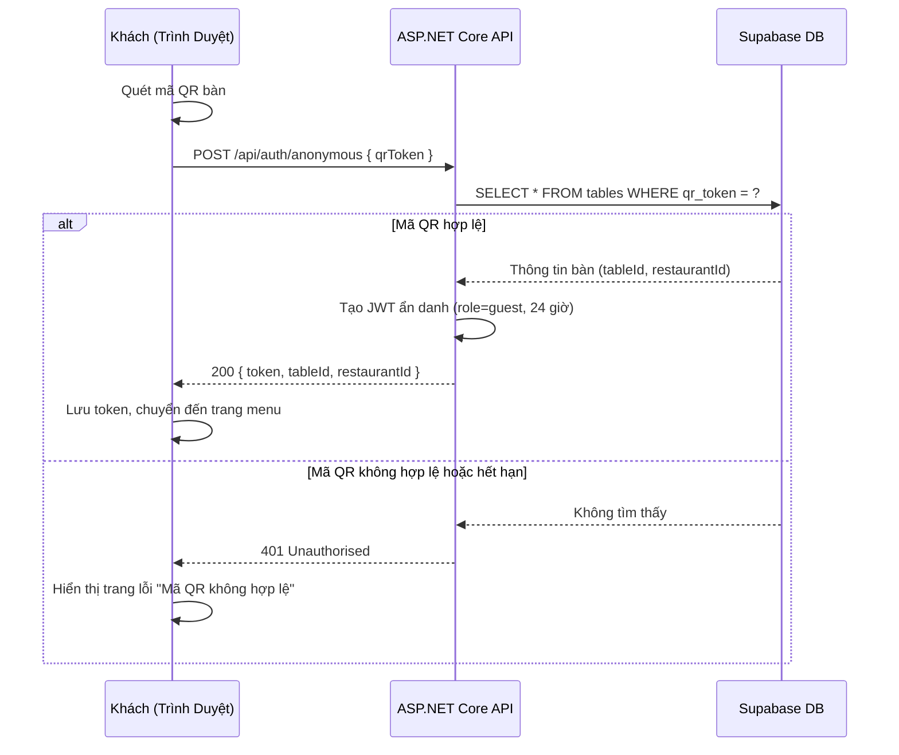
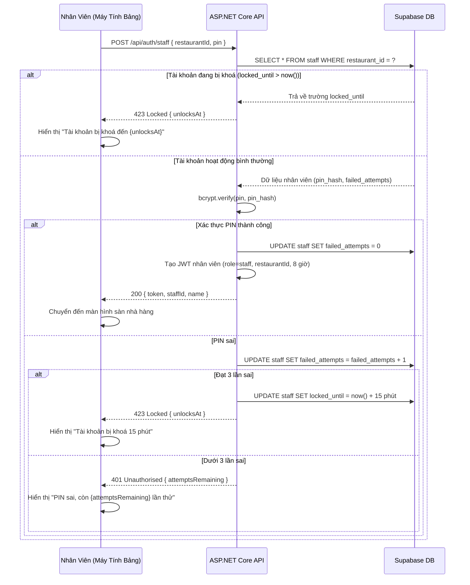
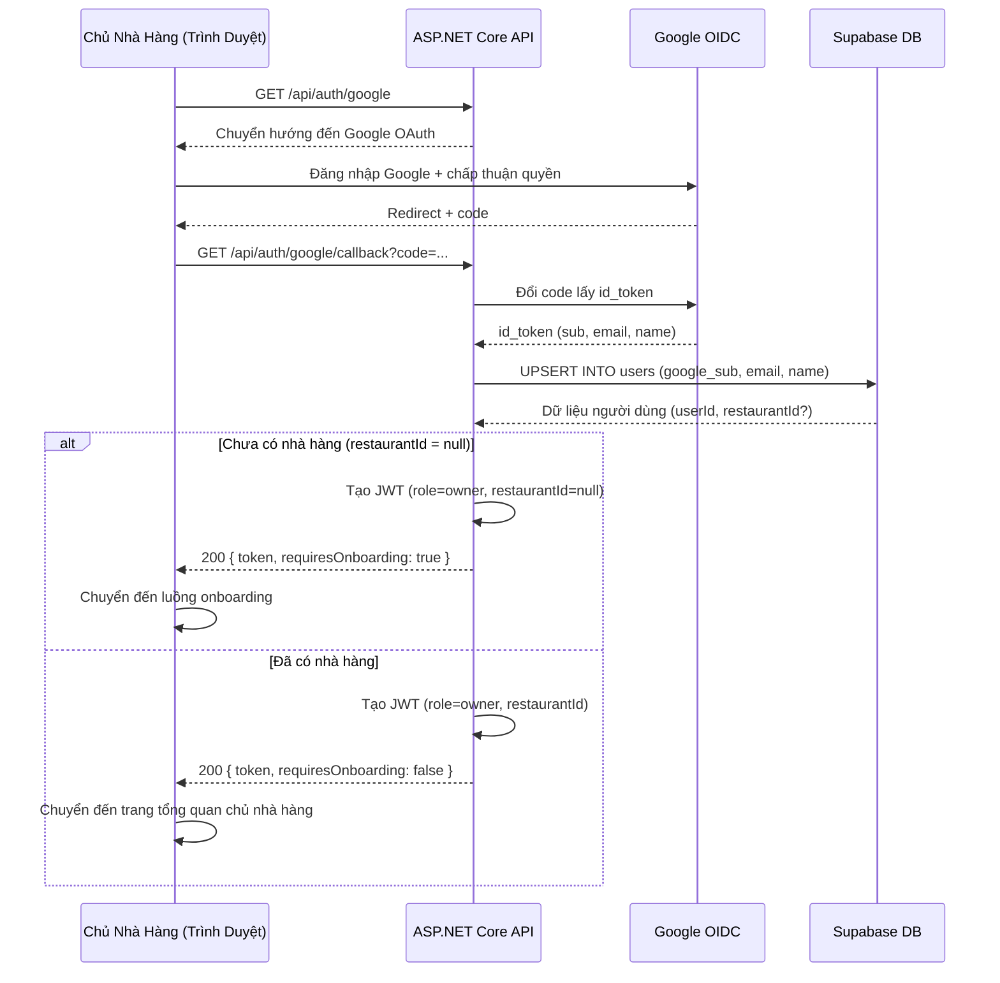
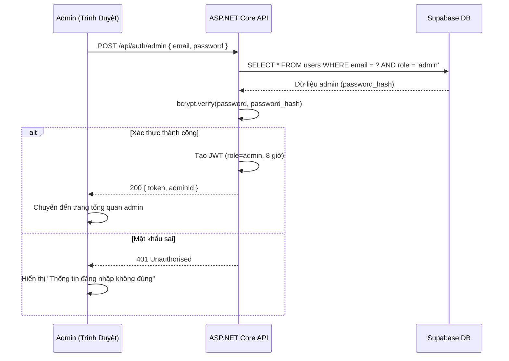

# Kiến Trúc: Luồng Xác Thực

**Loại:** Sơ đồ trình tự · **Phạm vi:** Bốn luồng xác thực trong hệ thống

---

## 1. Xác Thực Ẩn Danh Khách

---

## 2. Xác Thực PIN Nhân Viên

---

## 3. Google OAuth Chủ Nhà Hàng

---

## 4. Xác Thực Admin Được Cấu Hình Sẵn

> **Tài khoản Admin được tạo sẵn** trong quá trình triển khai thông qua biến môi trường `ADMIN_EMAIL` và `ADMIN_PASSWORD`. Admin không thể tự đăng ký — tài khoản phải được tạo thủ công bởi nhóm vận hành.

---

## 5. Bảng Phân Quyền JWT

| Vai Trò | Phạm Vi Token | Đường Dẫn Được Phép | Ghi Chú |
|---------|--------------|---------------------|---------|
| `guest` | 24 giờ | `/api/menus/*`, `/api/orders` (POST), `/api/orders/{id}` (GET) | Ràng buộc theo `tableId` và `restaurantId` |
| `staff` | 8 giờ | `/api/orders/*`, `/api/items/availability` | Ràng buộc theo `restaurantId` |
| `owner` | Phiên làm việc | Tất cả `/api/restaurants/{id}/*` | Ràng buộc theo `restaurantId` |
| `admin` | 8 giờ | `/api/admin/*` | Không ràng buộc nhà hàng |
