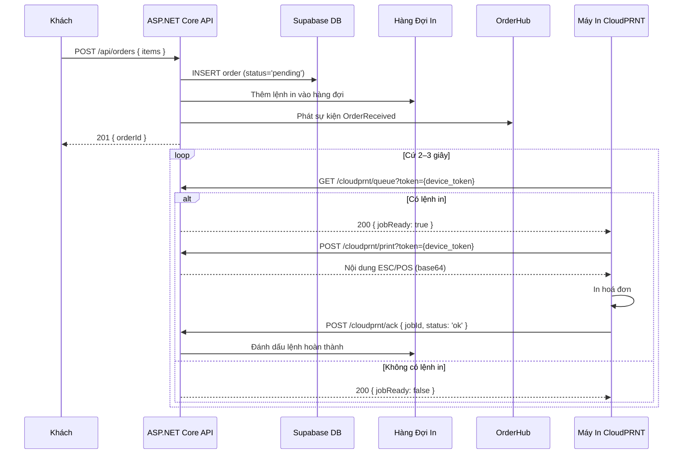
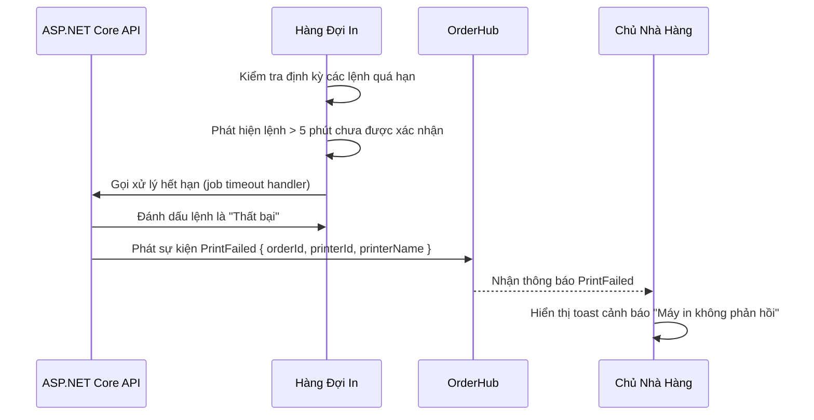

# Kiến Trúc: Luồng CloudPRNT

**Loại:** Sơ đồ trình tự · **Phạm vi:** Tích hợp máy in Star Micronics CloudPRNT

---

## 1. Tổng Quan Giao Thức

CloudPRNT sử dụng **giao thức server-pull**: máy in chủ động gọi đến máy chủ để lấy lệnh in. Máy chủ không gửi dữ liệu đến máy in.

```
Máy In → GET {server}/cloudprnt/queue?token={device_token}   (cứ 2–3 giây)
Máy Chủ → 200 { jobReady: true, mediaType: 'application/vnd.star.starprnt' }
Máy In → POST {server}/cloudprnt/print?token={device_token}  (lấy nội dung in)
Máy Chủ → 200 { content: '<ESC/POS bytes (base64)>' }
Máy In → POST {server}/cloudprnt/ack?token={device_token} { jobId }
```

---

## 2. Luồng In Thành Công



---

## 3. Luồng Máy In Không Trực Tuyến / Lệnh Hết Hạn



---

## 4. Bảo Mật Mã Thiết Bị

| Thuộc Tính | Chi Tiết |
|-----------|---------|
| Định dạng | UUID v4 (ví dụ: `a1b2c3d4-…`) |
| Hiển thị trong UI | 6 ký tự đầu + `…` (ví dụ: `a1b2c3…`) |
| Truyền tải | Chỉ qua HTTPS; đoạn URL, không phải query string |
| Tái tạo | `POST /api/printers/{id}/regenerate-token` — Owner only |
| Lưu trữ | `printers.device_token` — plaintext UUID (không nhạy cảm nếu chỉ qua HTTPS) |

> Không bao giờ hiển thị mã thiết bị đầy đủ trong log hoặc URL trong trình duyệt.

---

## 5. Định Dạng Hoá Đơn ESC/POS

```
============================================
         TÊN NHÀ HÀNG
         Địa Chỉ
         Điện Thoại
============================================
Bàn: Bàn 4                DD/MM/YYYY HH:mm
--------------------------------------------
ITEM NAME                               qty
  + Tùy chọn                               x
                                    VND xxx
--------------------------------------------
TỔNG CỘNG                        VND x,xxx
============================================
         Cảm ơn quý khách!
============================================
```

Nội dung được mã hoá **base64** trong phản hồi CloudPRNT và giải mã bởi firmware máy in.

---

## 6. Trạng Thái Máy In

| Trạng Thái | Điều Kiện | Màu Hiển Thị |
|-----------|----------|-------------|
| Trực Tuyến | `last_seen_at` < 60 giây trước | Xanh lá |
| Không Hoạt Động | `last_seen_at` từ 1–5 phút trước | Vàng |
| Ngoại Tuyến | `last_seen_at` > 5 phút trước | Đỏ |

`last_seen_at` được cập nhật mỗi khi máy in gọi đến endpoint `/cloudprnt/queue`.

---

## 7. Lưu Ý Phiên Bản 1

Trong phiên bản 1: **tất cả máy in** của một nhà hàng đều nhận cùng một bản sao lệnh in. Tính năng phân luồng (ví dụ: đồ uống đến quầy bar, món ăn đến bếp) sẽ được triển khai trong phiên bản sau.
