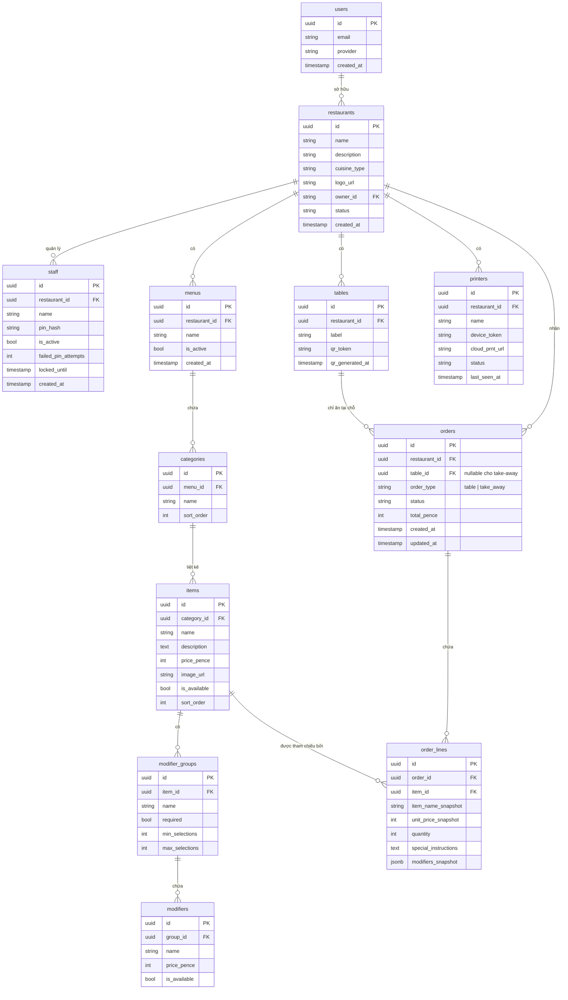

# Kiến Trúc: Mô Hình Dữ Liệu

**Loại:** Sơ Đồ ER · **Phạm Vi:** Schema Supabase PostgreSQL

---

## 1. Sơ Đồ Quan Hệ Thực Thể

---

## 2. Quyết Định Thiết Kế Chính

### 2.1 Trường Snapshot trong `order_lines`
`item_name_snapshot`, `unit_price_snapshot`, và `modifiers_snapshot` lưu trạng thái món ăn tại thời điểm đặt hàng. Chỉnh sửa menu sau khi đặt hàng không ảnh hưởng ngược lại các bản ghi đơn hàng đã tồn tại.

### 2.2 Cột `status` của Nhà Hàng
- `pending_approval` — mới đăng ký, chưa được admin duyệt
- `active` — đang hoạt động đầy đủ
- `suspended` — bị admin vô hiệu hoá; mọi đăng nhập đều bị chặn
- `rejected` — đơn đăng ký bị từ chối bởi admin

### 2.3 Bảo Mật PIN Nhân Viên
- `pin_hash` — hash bcrypt, không bao giờ lưu dạng văn bản
- `failed_pin_attempts` — bộ đếm tăng mỗi lần nhập sai
- `locked_until` — khoá 15 phút sau 3 lần nhập sai liên tiếp

### 2.4 Token QR Bàn
- `qr_token` — UUID, thay đổi khi kích hoạt "Tạo Lại QR"
- Token cũ lập tức không còn hiệu lực; các phiên khách đang hoạt động được xem là hết hạn

### 2.5 Lưu Trữ Giá
Tất cả giá được lưu dưới dạng số nguyên (xu hoặc đơn vị tiền tệ nhỏ nhất với VND). Không sử dụng số thực dấu phẩy động trong cơ sở dữ liệu hay API.

### 2.6 Xác thực `order_type`
- `table` — `table_id` phải không NULL; xác thực phía máy chủ; trả 422 nếu thiếu
- `take_away` — `table_id` phải NULL; trả 422 nếu có `tableId` được gửi

---

## 3. Tóm Tắt Bảng

| Bảng | Ước tính số hàng | Ghi Chú |
|------|-------------|-------|
| `restaurants` | 1 mỗi tenant | Thực thể tenant cốt lõi |
| `users` | 1 mỗi chủ nhà hàng | Quản lý bởi Supabase GoTrue |
| `staff` | ~5–30 mỗi nhà hàng | Xác thực PIN, không qua GoTrue |
| `tables` | ~5–50 mỗi nhà hàng | Liên kết QR |
| `menus` | 1–3 mỗi nhà hàng | Thông thường 1 menu đang hoạt động |
| `categories` | ~3–15 mỗi menu | |
| `items` | ~10–100 mỗi danh mục | Hình ảnh trên cloud storage |
| `modifier_groups` | 0–10 mỗi món | |
| `modifiers` | 2–10 mỗi nhóm | |
| `orders` | Khối lượng lớn | Nên phân vùng theo ngày |
| `order_lines` | ~3–10 mỗi đơn hàng | Chỉ thêm, không sửa |
| `printers` | 1–5 mỗi nhà hàng | Thiết bị CloudPRNT |
