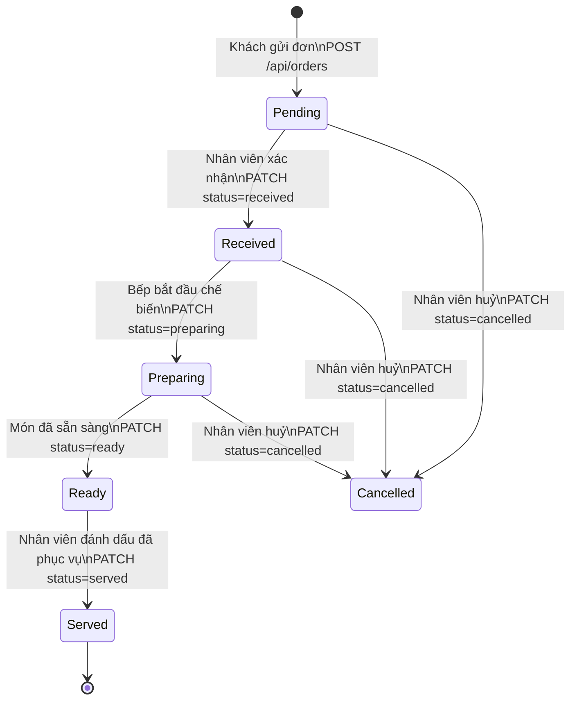
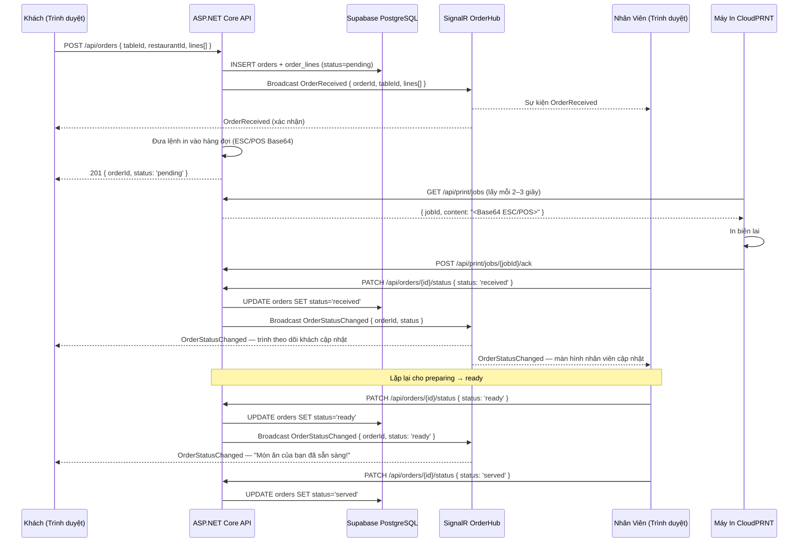
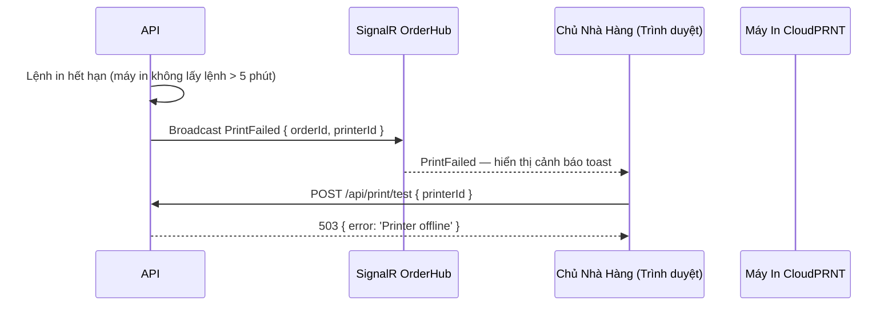

# Kiến Trúc: Luồng Đặt Hàng

**Loại:** Máy Trạng Thái + Sơ Đồ Tuần Tự · **Phạm Vi:** Toàn bộ vòng đời đơn hàng

---

## 1. Máy Trạng Thái Đơn Hàng

---

## 2. Chuỗi Đặt Hàng Đầy Đủ

---

## 3. Đường Dẫn Khi Lỗi In

---

## 4. Định Nghĩa Trạng Thái

| Trạng Thái | Người Thực Hiện | Ý Nghĩa |
|--------|-------|---------|
| `pending` | Hệ thống | Đơn hàng đã gửi, chờ nhân viên xác nhận |
| `received` | Nhân viên | Nhân viên đã nhìn thấy và xác nhận đơn hàng |
| `preparing` | Nhân viên | Bếp đang tích cực chế biến |
| `ready` | Nhân viên | Món đã trang trí và sẵn sàng phục vụ |
| `served` | Nhân viên | Đã mang ra bàn |
| `cancelled` | Nhân viên | Đã huỷ trước khi hoàn thành |

---

## 5. Đảm Bảo Giao Nhận Thời Gian Thực

- **SignalR với fanout nhóm** — tất cả thành viên nhóm nhận được sự kiện
- **Khả năng phục hồi khi kết nối lại** — clients đăng ký lại nhóm khi kết nối lại; composable Vue xử lý exponential backoff (1 s → 2 s → 4 s … tối đa 30 s)
- **Sự kiện bị bỏ lỡ** — khi kết nối lại, clients gọi `GET /api/orders?tableId=X&status=active` để đồng bộ lại trạng thái
