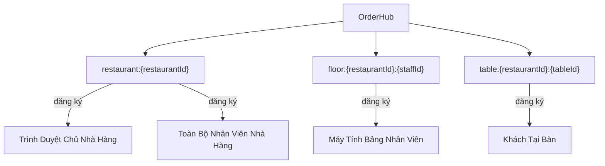
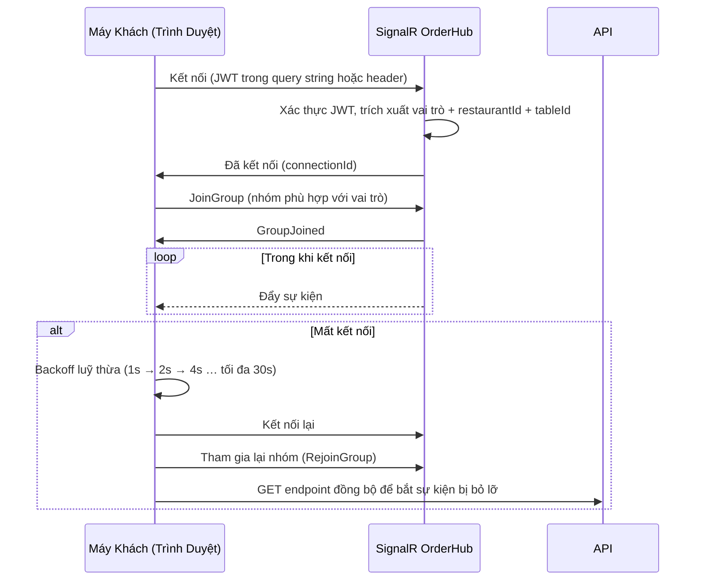

# Kiến Trúc: Sự Kiện SignalR

**Loại:** Đồ thị + Bảng tham chiếu · **Phạm vi:** Mô hình sự kiện SignalR OrderHub

---

## 1. Cấu Trúc Nhóm Hub



---

## 2. Danh Mục Sự Kiện

### 2.1 `OrderReceived`

**Chiều:** Máy chủ → Máy khách  
**Nhóm:** `restaurant:{restaurantId}`  
**Kích hoạt bởi:** `POST /api/orders` (đơn hàng mới được tạo)

```typescript
{
  event: 'OrderReceived',
  payload: {
    orderId: string,
    tableId: string,
    tableLabel: string,
    items: [{ name, quantity, modifiers, specialInstructions }],
    total: number,
    createdAt: string
  }
}
```

**Người nhận:** Chủ nhà hàng, toàn bộ nhân viên  
**Tác động:** Màn hình sàn nhà hàng hiển thị badge đơn hàng mới; tổng quan của chủ cập nhật số lượng đơn hàng

---

### 2.2 `OrderStatusChanged`

**Chiều:** Máy chủ → Máy khách  
**Nhóm:** `restaurant:{restaurantId}` + `table:{restaurantId}:{tableId}`  
**Kích hoạt bởi:** `PATCH /api/orders/{id}/status`

```typescript
{
  event: 'OrderStatusChanged',
  payload: {
    orderId: string,
    tableId: string,
    status: 'received' | 'preparing' | 'ready' | 'served' | 'cancelled',
    updatedAt: string
  }
}
```

**Người nhận:** Nhân viên (nhóm nhà hàng) + Khách (nhóm bàn)  
**Tác động:**
- Thanh tiến trình của khách cập nhật trạng thái
- Thẻ đơn hàng trên màn hình nhân viên cập nhật chip trạng thái
- Trạng thái `ready` kích hoạt thông báo PWA cho khách

---

### 2.3 `PrintFailed`

**Chiều:** Máy chủ → Máy khách  
**Nhóm:** `restaurant:{restaurantId}`  
**Kích hoạt bởi:** Lệnh in hết hạn (> 5 phút không được máy in xác nhận)

```typescript
{
  event: 'PrintFailed',
  payload: {
    orderId: string,
    printerId: string,
    printerName: string,
    jobId: string,
    failedAt: string
  }
}
```

**Người nhận:** Chủ nhà hàng, toàn bộ nhân viên  
**Tác động:** Hiển thị toast cảnh báo trên tổng quan chủ và màn hình sàn nhân viên

---

### 2.4 `MenuItemAvailabilityChanged`

**Chiều:** Máy chủ → Máy khách  
**Nhóm:** `restaurant:{restaurantId}`  
**Kích hoạt bởi:** `PATCH /api/items/{id} { isAvailable: false }` (chủ chuyển trạng thái món)

```typescript
{
  event: 'MenuItemAvailabilityChanged',
  payload: {
    itemId: string,
    restaurantId: string,
    isAvailable: boolean,
    updatedAt: string
  }
}
```

**Người nhận:** Chủ nhà hàng, toàn bộ nhân viên, tất cả khách đang xem menu  
**Tác động:**
- Trang menu làm xám món ăn và hiển thị chip "Hết Món"
- Các món trong giỏ hàng của khách hiển thị cảnh báo: "Món này không còn — vui lòng xoá trước khi đặt hàng"

---

## 3. Vòng Đời Đăng Ký Nhóm



---

## 4. Ưu Tiên Transport Kết Nối

SignalR tự chọn transport tốt nhất:

1. **WebSocket** — ưu tiên hàng đầu; độ trễ thấp nhất
2. **Server-Sent Events** — dự phòng khi proxy chặn WebSocket
3. **Long Polling** — phương án cuối; hoạt động mọi nơi

Tất cả ba transport đều dùng chung mô hình sự kiện và nhóm.

---

## 5. Quy Tắc Phân Quyền

| Vai Trò JWT | Nhóm Được Tham Gia | Sự Kiện Nhận Được |
|------------|-------------------|-------------------|
| `guest` | Chỉ `table:{restaurant}:{table}` | `OrderStatusChanged` |
| `staff` | `restaurant:{restaurant}` + `floor:{restaurant}:{staff}` | `OrderReceived`, `OrderStatusChanged`, `PrintFailed`, `MenuItemAvailabilityChanged` |
| `owner` | `restaurant:{restaurant}` | Tất cả sự kiện |
| `admin` | Không có (Admin không có UI thời gian thực) | — |

Hub kiểm tra quyền khi nhận lệnh `JoinGroup`; yêu cầu tham gia trái phép bị từ chối với HTTP 403.
