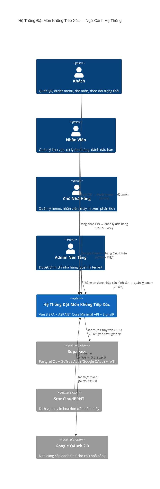

# Kiến Trúc: Tổng Quan Hệ Thống

**Loại:** Sơ Đồ Ngữ Cảnh C4 · **Phạm Vi:** Toàn nền tảng

---

## 1. Ngữ Cảnh Vận Hành



---

## 2. Sơ Đồ Triển Khai

```
┌──────────────────────────────────────────────────────────────────┐
│                        GitHub Pages (CDN)                        │
│         Vue 3 SPA + Vuetify 3 + Pinia + Vue Router 4            │
│               (File tĩnh — bản build Vite production)           │
└────────────────────────────┬─────────────────────────────────────┘
                             │ HTTPS
                             ▼
┌──────────────────────────────────────────────────────────────────┐
│                    Render / Railway (hoặc tương tự)              │
│          ASP.NET Core 10 Minimal API  +  SignalR OrderHub        │
│                     .NET 10 / C# 14                              │
└────────────┬───────────────────┬──────────────────────┬──────────┘
             │                   │                      │
             ▼ PostgREST         ▼ GoTrue Auth          ▼ WSS/HTTPS
┌────────────┴──────┐  ┌─────────┴──────────┐  ┌───────┴──────────┐
│  Supabase         │  │  Google OAuth 2.0  │  │  Star CloudPRNT  │
│  PostgreSQL       │  │                    │  │  Máy In Hoá Đơn  │
└───────────────────┘  └────────────────────┘  └──────────────────┘
```

---

## 3. Các Đường Giao Tiếp Chính

| Đường | Giao Thức | Ghi Chú |
|------|----------|-------|
| Khách → API | HTTPS REST | JWT ẩn danh được cấp khi truy cập lần đầu |
| Nhân viên → API | HTTPS REST | bcrypt PIN → JWT (8 giờ) |
| Chủ nhà hàng → API | HTTPS REST | Google OIDC → JWT |
| Admin → API | HTTPS REST | Email/mật khẩu cấu hình sẵn → JWT |
| Tất cả clients → SignalR | WSS (WebSocket) | Dự phòng: Server-Sent Events, Long Polling |
| CloudPRNT → API | HTTPS REST | Máy in lấy lệnh mỗi 2–3 giây |
| API → Supabase | HTTPS REST | Khoá service role (chỉ phía server) |

---

## 4. Nhóm SignalR Hub

```
OrderHub
  ├── restaurant:{restaurantId}        — chủ nhà hàng, toàn bộ nhân viên
  ├── floor:{restaurantId}:{staffId}   — máy tính bảng nhân viên riêng lẻ
  └── table:{restaurantId}:{tableId}  — khách tại bàn cụ thể
```

Sự kiện được đẩy qua SignalR:

| Sự Kiện | Chiều | Người Nhận |
|---------|-------|-----------|
| `OrderReceived` | Server → Client | Chủ nhà hàng, Nhân viên |
| `OrderStatusChanged` | Server → Client | Khách, Nhân viên |
| `PrintFailed` | Server → Client | Chủ nhà hàng |
| `MenuItemAvailabilityChanged` | Server → Client | Tất cả khách tại nhà hàng |

---

## 5. Ranh Giới Bảo Mật

- **API** là hệ thống duy nhất giữ khoá service role của Supabase
- **Clients** không bao giờ kết nối trực tiếp với Supabase
- **Admin** được cấu hình sẵn — không có đường tự đăng ký
- **PIN nhân viên** được mã hoá một chiều bằng bcrypt; không bao giờ truyền sau khi tạo
