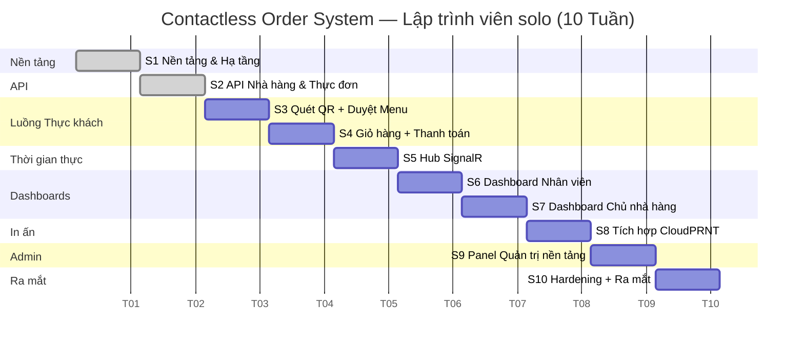

# Lịch trình & Ước tính Khối lượng Công việc

**Contactless Order System** · Kế hoạch Sprint · v1.0

---

## Tổng quan

| Kịch bản | Thời gian | Ghi chú |
|----------|-----------|---------|
| **Lập trình viên solo** | ~10 tuần | Một full-stack dev, 5–6 giờ làm việc hiệu quả/ngày |
| **Nhóm 2 người** | ~6 tuần | Backend + frontend song song; một số sprint chạy đồng thời |
| **Dự phòng rủi ro (+20%)** | +2 tuần | Tích hợp chưa biết, chu kỳ phản hồi từ stakeholder |

> **Giả định:** Mỗi sprint là 1 tuần lịch. Lập trình viên quen với .NET, Vue 3 và Supabase nhưng chưa từng xây dựng CloudPRNT hay Docker blue-green deployment trước đây.

---

## Chi tiết từng Sprint

### Sprint 1 — Nền tảng & Hạ tầng
**Thời gian:** 1 tuần · **Nỗ lực:** ~21 story points

| Công việc | Ghi chú |
|-----------|---------|
| Cài đặt monorepo (`src/Api/`, `src/Frontend/`) | GitHub Actions được scaffold |
| Schema cơ sở dữ liệu + chính sách RLS Supabase | Tất cả bảng, ràng buộc, bảo mật hàng |
| Skeleton middleware xác thực (JWT validation, tenant scoping) | Middleware xác thực JWT Supabase |
| Pipeline CI/CD | GitHub Actions → SSH deploy lên Civo VM |
| Cài đặt Docker Compose blue-green | `docker-compose.blue.yml`, `docker-compose.green.yml`, `switch-stack.sh` |
| Tài liệu VitePress cơ bản | Bao gồm kiến trúc, PRD, project context |

**Sản phẩm bàn giao:** Skeleton có thể deploy với CI/CD. `GET /health` trả về 200 trên production.

---

### Sprint 2 — API Nhà hàng & Thực đơn
**Thời gian:** 1 tuần · **Nỗ lực:** ~18 story points

| Công việc | Ghi chú |
|-----------|---------|
| CRUD endpoint nhà hàng | Scoped theo chủ sở hữu; RLS Supabase được áp dụng |
| CRUD danh mục + món ăn trên thực đơn | Với toggle trạng thái hàng và soft-delete (ẩn) |
| CRUD nhóm modifier + modifier | Nhóm bắt buộc/tùy chọn, chênh lệch giá, min/max selections |
| Tích hợp Supabase Storage | Ảnh món ăn qua S3-compatible bucket |
| Quản lý bàn + tạo token QR | Token nhà hàng ký HMAC; tải về PNG/PDF |

**Sản phẩm bàn giao:** Chủ nhà hàng có thể cấu hình nhà hàng đầy đủ (thực đơn, bàn, QR) qua API.

---

### Sprint 3 — Luồng Thực khách: Quét QR → Duyệt Menu
**Thời gian:** 1 tuần · **Nỗ lực:** ~16 story points

| Công việc | Ghi chú |
|-----------|---------|
| Quét QR → xác thực token → mở phiên thực khách | Không đăng nhập, không cài app |
| Scaffold frontend Vue 3 + Vuetify | Routing theo vai trò; Pinia state |
| Trang duyệt menu (danh mục + món ăn) | Món hết hàng bị vô hiệu hóa về mặt hiển thị |
| Trang chi tiết món với modifier | Validation modifier bắt buộc trước khi thêm giỏ |
| Hiển thị ảnh món ăn | Lazy-loaded từ Supabase Storage |

**Sản phẩm bàn giao:** Thực khách có thể quét QR, duyệt menu và xem chi tiết món trên di động.

---

### Sprint 4 — Luồng Thực khách: Giỏ hàng, Thanh toán & Xác nhận
**Thời gian:** 1 tuần · **Nỗ lực:** ~18 story points

| Công việc | Ghi chú |
|-----------|---------|
| Trạng thái giỏ hàng (thêm, xóa, điều chỉnh số lượng, ghi chú món) | Pinia; duy trì qua tải lại trang |
| Chọn số bàn khi thanh toán | Dropdown từ danh sách bàn đang hoạt động |
| API endpoint gửi đơn hàng | Tạo order + items + modifiers theo giao dịch |
| Xác nhận trực tiếp + số đơn hàng | Phản hồi ngay sau khi gửi |
| Đặt thêm đơn trong cùng phiên | Thực khách có thể đặt nhiều đơn |
| PWA: Web App Manifest + Service Worker | Có thể cài; cache tài nguyên; trang fallback offline |

**Sản phẩm bàn giao:** Luồng đặt hàng từ đầu đến cuối hoạt động trên di động (chưa có cập nhật thời gian thực).

---

### Sprint 5 — Thời gian thực: Hub SignalR
**Thời gian:** 1 tuần · **Nỗ lực:** ~16 story points

| Công việc | Ghi chú |
|-----------|---------|
| `OrderHub` — nhóm theo nhà hàng, theo bàn, theo bếp | SignalR với fallback long-polling |
| Sự kiện `OrderReceived` → nhóm bếp + quầy bar | Kích hoạt khi tạo đơn hàng |
| Sự kiện `OrderStatusChanged` → nhóm bàn | Thực khách thấy trạng thái trực tiếp |
| Sự kiện `TableSessionClosed` → nhóm bàn | Xóa giao diện phiên thực khách |
| Trang trạng thái đơn hàng trực tiếp | Hiển thị trạng thái từng món theo thời gian thực |
| Cảnh báo đơn ở trạng thái "Tiếp nhận" > 5 phút | Ngưỡng có thể cấu hình |

**Sản phẩm bàn giao:** Thực khách thấy cập nhật trạng thái đơn hàng trực tiếp; bếp nhận đơn mới theo thời gian thực.

---

### Sprint 6 — Dashboard Nhân viên
**Thời gian:** 1 tuần · **Nỗ lực:** ~16 story points

| Công việc | Ghi chú |
|-----------|---------|
| Xác thực PIN nhân viên (4–6 chữ số) | PIN băm bcrypt; không cần email |
| Màn hình tổng quan bàn với chip trạng thái | Trống / Có khách / Cần chú ý |
| Danh sách đơn hoạt động theo bàn | Sắp xếp theo thời gian; hiển thị danh sách món |
| Đánh dấu đơn là Đã phục vụ | Cập nhật trạng thái qua API + SignalR broadcast |
| Hủy đơn hàng | Với dialog xác nhận |
| Đóng phiên bàn + reset bàn | Xóa tất cả đơn hoạt động của bàn |

**Sản phẩm bàn giao:** Nhân viên có thể quản lý tất cả bàn và đơn hàng từ một dashboard.

---

### Sprint 7 — Dashboard Chủ nhà hàng
**Thời gian:** 1 tuần · **Nỗ lực:** ~20 story points

| Công việc | Ghi chú |
|-----------|---------|
| Đăng nhập Google OAuth qua Supabase Auth | Tài khoản mới bắt đầu ở trạng thái "Chờ phê duyệt" |
| Hồ sơ nhà hàng (tên, logo, địa chỉ, giờ mở cửa) | Hiển thị trên header menu thực khách |
| UI quản lý thực đơn | CRUD danh mục + món với upload ảnh |
| UI quản lý nhóm modifier | Trình chỉnh sửa nội tuyến theo từng món |
| Toggle trạng thái hàng tức thì ("hết hàng") | Có hiệu lực ngay trên menu thực khách |
| Quản lý PIN nhân viên | Tạo / vô hiệu hóa tài khoản nhân viên |
| Quản lý bàn | Thêm, đổi tên, vô hiệu hóa bàn |
| Tải về mã QR (PNG) | Để in ấn thực tế |
| Đăng ký device token CloudPRNT | Token bếp + token bar lưu theo nhà hàng |

**Sản phẩm bàn giao:** Chủ nhà hàng có thể cấu hình đầy đủ nhà hàng và quản lý hàng ngày.

---

### Sprint 8 — Tích hợp CloudPRNT
**Thời gian:** 1 tuần · **Nỗ lực:** ~16 story points

| Công việc | Ghi chú |
|-----------|---------|
| Hàng đợi job in (lưu trong DB) | Job được tạo khi gửi đơn hàng |
| Endpoint `GET /api/print/poll?deviceToken=<token>` | Trả về payload Base64 ESC/POS khi có job chờ |
| Tạo lệnh ESC/POS (định dạng Star) | Số bàn, số đơn, món, số lượng, ghi chú |
| Định tuyến đồ ăn → token bếp / đồ uống → token bar | Dựa trên cột `item_type` |
| Xác nhận `POST /api/print/status/{jobId}` | Đánh dấu job đã được giao |
| Phát hiện lỗi in + timeout | Cảnh báo trên Staff Dashboard nếu job không được nhận |

**Sản phẩm bàn giao:** Máy in bếp và quầy bar nhận vé được định tuyến đúng tự động với mỗi đơn hàng.

---

### Sprint 9 — Panel Quản trị nền tảng
**Thời gian:** 1 tuần · **Nỗ lực:** ~18 story points

| Công việc | Ghi chú |
|-----------|---------|
| Xác thực admin nền tảng | Role claim riêng trong JWT Supabase |
| Danh sách tenant (tất cả nhà hàng + trạng thái) | Có thể sắp xếp, lọc |
| Tạo tenant mới | Khởi tạo nhà hàng + tài khoản chủ sở hữu |
| Tạm dừng / khôi phục tenant | Có hiệu lực ngay qua RLS |
| Hàng đợi phê duyệt | Liệt kê chủ sở hữu ở trạng thái "Chờ phê duyệt" |
| Phê duyệt / từ chối đăng ký | Phê duyệt kích hoạt tài khoản; từ chối gửi email thông báo |
| Số liệu đơn hàng tổng hợp | Số đơn tổng hợp theo ngày / tuần |

**Sản phẩm bàn giao:** Admin nền tảng có thể onboard nhà hàng và quản lý vòng đời tenant.

---

### Sprint 10 — Hardening, QA & Ra mắt
**Thời gian:** 1 tuần · **Nỗ lực:** ~15 story points

| Công việc | Ghi chú |
|-----------|---------|
| Kiểm tra bảo mật OWASP Top 10 | Sửa các vấn đề XSS, injection, auth |
| Kiểm tra hiệu năng | Tải trang < 2s trên 4G; gửi đơn < 500ms P95 |
| Kiểm tra WCAG 2.1 AA trên trang thực khách | Screen reader + điều hướng bàn phím |
| Chạy kiểm thử end-to-end (luồng thành công đầy đủ) | QR → đặt món → in → cập nhật trạng thái |
| Kiểm tra smoke deployment blue-green | Xác nhận chuyển đổi zero-downtime |
| Cài đặt monitoring | Nginx access logs, Supabase dashboard, kiểm tra uptime |
| Đánh giá stakeholder + sửa lỗi | Buffer cho các thay đổi yêu cầu |

**Sản phẩm bàn giao:** Deployment production v1.0 với monitoring hoạt động.

---

## Tóm tắt các Mốc

---

## Khối lượng theo Lĩnh vực

| Lĩnh vực | Sprint | Story Points | % Tổng |
|----------|--------|-------------|--------|
| Nền tảng & Hạ tầng | 1 | 21 | 12% |
| API Backend (Thực đơn, Auth, Đơn hàng) | 2 | 18 | 10% |
| Luồng Thực khách (QR, Giỏ hàng, PWA) | 3–4 | 34 | 20% |
| Thời gian thực (SignalR) | 5 | 16 | 9% |
| Dashboard Nhân viên | 6 | 16 | 9% |
| Dashboard Chủ nhà hàng | 7 | 20 | 12% |
| Tích hợp CloudPRNT | 8 | 16 | 9% |
| Admin nền tảng | 9 | 18 | 10% |
| Hardening & Ra mắt | 10 | 15 | 9% |
| **Tổng cộng** | **10** | **174** | **100%** |

---

## Kịch bản theo Quy mô Nhóm

### Lập trình viên solo (10 Tuần)
Tất cả sprint theo thứ tự. Không có công việc song song.

### Nhóm 2 người (6 Tuần)
Backend và frontend chia tách — một số sprint có thể chạy song song:

| Tuần | Dev A (Backend) | Dev B (Frontend) |
|------|----------------|-----------------|
| 1 | S1: Nền tảng, DB, auth, CI/CD | S1: Scaffold frontend, cài đặt Vuetify |
| 2 | S2: API Nhà hàng + Thực đơn | S3: UI duyệt menu thực khách |
| 3 | S5: Hub SignalR | S4: Giỏ hàng + thanh toán + PWA |
| 4 | S8: CloudPRNT + phía API của S6 | S6: UI Dashboard Nhân viên |
| 5 | S9: API Admin nền tảng | S7: UI Dashboard Chủ nhà hàng |
| 6 | S10: Kiểm tra bảo mật, hạ tầng | S10: Hiệu năng + tiếp cận + QA |

---

## Sổ đăng ký Rủi ro

| Rủi ro | Khả năng | Tác động | Biện pháp |
|--------|---------|---------|-----------|
| Định dạng lệnh ESC/POS CloudPRNT không có tài liệu đầy đủ | Trung bình | Cao | Dùng tài liệu tham khảo Star SDK; kiểm thử với mC-Print3 thực tế ở tuần 8 |
| Chính sách RLS Supabase phức tạp để cài đúng | Trung bình | Cao | Dành thêm thời gian trong S1; thêm integration test cho cô lập cross-tenant |
| Độ trễ cold-start Vercel trên trang menu thực khách | Thấp | Trung bình | Pre-render hoặc SSG menu; dùng Vercel Edge Network |
| Chuyển đổi blue-green gây mất phiên | Thấp | Trung bình | Kiểm thử trong môi trường dev trước production; dùng sticky session nếu cần |
| Stakeholder yêu cầu thay đổi phạm vi trong S10 | Cao | Trung bình | Chốt phạm vi sau S9; đưa các item vào backlog v1.1 |

---

*Ước tính chỉ mang tính chất lập kế hoạch. Tốc độ thực tế sẽ thay đổi tùy theo kinh nghiệm lập trình viên, độ ổn định API bên thứ ba và chu kỳ phản hồi stakeholder. Cập nhật lần cuối: Tháng 3 năm 2026.*
